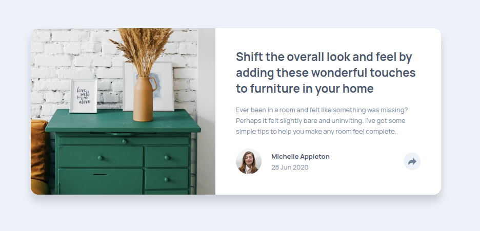
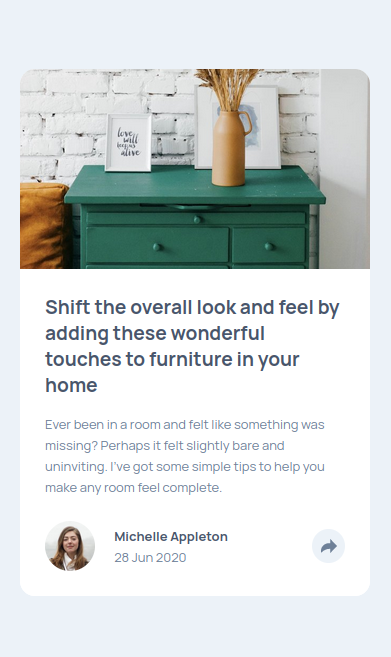

# Frontend Mentor - Article preview component solution

This is a solution to the [Article preview component challenge on Frontend Mentor](https://www.frontendmentor.io/challenges/article-preview-component-dYBN_pYFT). Frontend Mentor challenges help you improve your coding skills by building realistic projects.

## Table of contents

- [Overview](#overview)
  - [The challenge](#the-challenge)
  - [Screenshot](#screenshot)
  - [Links](#links)
- [My process](#my-process)
  - [Built with](#built-with)
  - [What I learned](#what-i-learned)
  - [Continued development](#continued-development)
- [Author](#author)
- [Acknowledgments](#acknowledgments)

## Overview

### The challenge

Users should be able to:

- View the optimal layout for the component depending on their device's screen size
- See the social media share links when they click the share icon

### Screenshot

- Desktop View

- Mobile View

### Links

- Solution URL: [Add solution URL here](https://your-solution-url.com)
- Live Site URL: [Add live site URL here](https://your-live-site-url.com)

## My process

### Built with

- Semantic HTML5 markup
- CSS custom properties
- Flexbox
- [jQuery](https://jquery.com/) - JS library

### What I learned

- I learned that for an item to be aligned vertically in a flex system, width of the parent element needs to be specified

- To reduce the height of an element in a flex-box, set to column. Specify the max-height of the specific element.

### Continued development

I really hope to get better at using flex box for complex designs and follow best practices for DOM manipulation.

## Author

- Frontend Mentor - [@Julius-Java](https://www.frontendmentor.io/profile/Julius-Java)
- Twitter - [@Julius_Java00](https://www.twitter.com/julius_java00)
